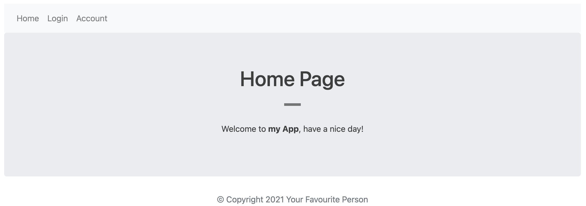
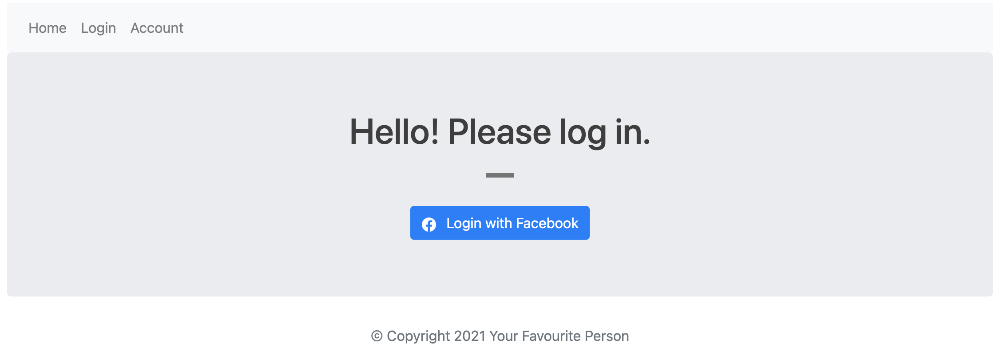
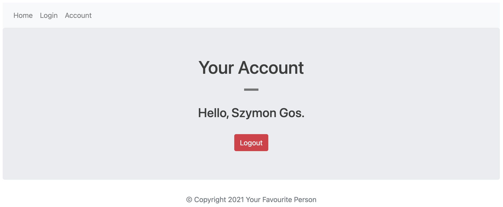

# Introduction

Facebook Login System is widely used, mainly when I am asked to register/log in to the site. I decided to build my own app that's using such as a system using Node.js with a small Express.js library as an application server. 

Bonus: I added a little bit of styling with EJS, so the app doesn't look like a website from 2000 :)

## What I learnt

There are several learning outcomes from this project. First, I found Node.js to be intuitive and pleasant to use. Second, Express middleware are functions that execute during the lifecycle of a request to the Express server and each middleware have an access to HTTP `request` and `response`. I learnt that there are several middlewares using by ExpressJS such as:

* Application level middleware: `app.use`
* Router level middleware `router.use`
* Built-in middleware `express.static,express.json, express.urlencoded`
* Thirdparty middleware `bodyparser, cookieparser`

Third, passport authentication used in this code is extremely flexible and can be dropped into an Express-based app. Additionally, supports authentication using Facebook. 

Update: I was screening the `app.js` and I noticed that I have to read line by line to find clientID and clientSecret. It's a small project, however, in bigger applications, this could cause a problem to find variables to be managed. So after a little research, I decided to use `dotenv` package for creating a separate file called `.env` to store important environment variables such as clientID and clientSecret. Due to the fact those variables are sensitive, I added `.env` to `.gitingore` and create `.env.example` to show what pieces of data are stored.

## How To Use The App

1. To use the app, please clone the repo `git clone https://github.com/SzymonGos/facebook_login_nodejs_express.git` or download the zip file.

2. Set up environment by installing [Node.js](https://nodejs.org/en/download/)

3. Install dependencies defined in a package.json `npm install`

4. Create own Facebook App [here](https://magefan.com/blog/create-facebook-application) and replace `clientID` and `clientSecret` in the code.(please create a `.env` file and use the `.env.example` to manage connection or change it manually in the code)

5. Run the app `node app.js`

6. The app is running on port 3000, `http://localhost:3000/`

7. Optional: to remove git, type command `rm -rf .git`

## Results 

Home page

    

Login Page

    

Account Page

    

### Something To Read

[Node.js guide](https://nodejs.org/en/docs/guides/)

[Express.js guide](https://expressjs.com/en/guide/routing.html)

[Passport authentication](http://www.passportjs.org/docs/downloads/html/)

[Node.js environment files](https://medium.com/the-node-js-collection/making-your-node-js-work-everywhere-with-environment-variables-2da8cdf6e786)